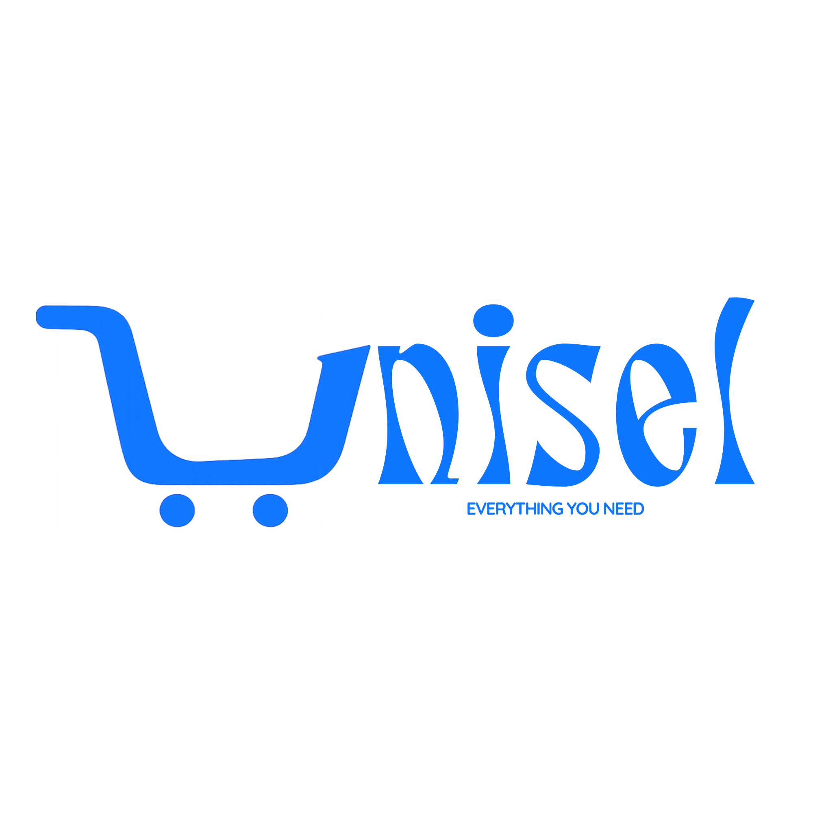

<p align="center">
  
</p>

<h1 align="center">UniSel 🛒</h1>

UniSel is a full-stack e-commerce platform that allows users to buy and sell products. It provides a seamless experience for users to list their own products for sale, browse products from other sellers, manage their shopping cart, and securely checkout.

## 🚀 Features

- **User Authentication:** Secure signup and login using JWT.
- **Product Management:** Users can add, edit, and delete their own products.
- **Browse & Search:** Explore a wide variety of products listed by different sellers.
- **Shopping Cart:** Add products to a cart and manage quantities.
- **Checkout:** Seamless checkout process.
- **Image Uploads:** Product images are uploaded and managed via Cloudinary.
- **Responsive Design:** A beautiful, modern user interface built with Tailwind CSS.

## 🛠️ Tech Stack

### Frontend (Client)
- **Framework:** [React](https://reactjs.org/) with [Vite](https://vitejs.dev/)
- **Language:** TypeScript
- **Styling:** [Tailwind CSS](https://tailwindcss.com/)
- **State Management:** [Redux Toolkit](https://redux-toolkit.js.org/)
- **Routing:** [React Router](https://reactrouter.com/)
- **Form Handling:** React Hook Form
- **Authentication/Storage integrations:** Firebase
- **Icons:** Lucide React & FontAwesome

### Backend (Server)
- **Runtime:** [Node.js](https://nodejs.org/)
- **Framework:** [Express.js](https://expressjs.com/)
- **Language:** TypeScript
- **Database:** [MongoDB](https://www.mongodb.com/) with [Mongoose](https://mongoosejs.com/)
- **Authentication:** JSON Web Tokens (JWT) & bcryptjs for password hashing

## 📂 Project Structure

The project is structured as a monorepo containing both the client and server codebases:

```text
unisel/
├── client/       # React frontend application
└── server/       # Node.js/Express backend API
```

## ⚙️ Installation & Setup

### Prerequisites
- Node.js installed on your machine
- MongoDB running locally or a MongoDB Atlas URI

### 1. Clone the repository
```bash
git clone <repository-url>
cd unisel
```

### 2. Backend Setup
```bash
cd server
npm install
```

Create a `.env` file in the `server` directory and configure the following variables:
```env
PORT=3000
MONGO_URI=mongodb://localhost:27017/unisel # Or your MongoDB Atlas URI
JWT_SECRET=your_jwt_secret_key
```

Start the backend server:
```bash
# Development mode
npm run dev
```

### 3. Frontend Setup
Open a new terminal window/tab:
```bash
cd client
npm install
```

Create a `.env` file in the `client` directory and configure the following variables:
```env
VITE_FIREBASE_API_KEY=your_firebase_api_key
VITE_AUTH_DOMAIN=your_firebase_auth_domain
VITE_PROJECT_ID=your_firebase_project_id
VITE_STORAGE_BUCKET=your_firebase_storage_bucket
VITE_MESSAGING_SENDER_ID=your_firebase_messaging_sender_id
VITE_APP_ID=your_firebase_app_id
VITE_MEASUREMENT_ID=your_firebase_measurement_id

VITE_CLOUDINARY_CLOUD_NAME=your_cloudinary_cloud_name
VITE_CLOUDINARY_UPLOAD_PRESET=your_cloudinary_upload_preset
```

Start the frontend development server:
```bash
npm run dev
```

## 📜 Scripts

### Client
- `npm run dev`: Starts the Vite development server.
- `npm run build`: Builds the app for production.
- `npm run lint`: Runs ESLint to check for code issues.

### Server
- `npm run dev`: Starts the backend server in development mode using `ts-node-dev`.
- `npm run build`: Compiles TypeScript to JavaScript.
- `npm run start`: Runs the compiled JavaScript code.

## 🤝 Contributing

Contributions, issues, and feature requests are always welcome! This project is completely open for contribution. 

If you have a suggestion that would make this better, please fork the repo and create a pull request. You can also simply open an issue with the tag "enhancement".

1. Fork the Project
2. Create your Feature Branch (`git checkout -b feature/AmazingFeature`)
3. Commit your Changes (`git commit -m 'Add some AmazingFeature'`)
4. Push to the Branch (`git push origin feature/AmazingFeature`)
5. Open a Pull Request
